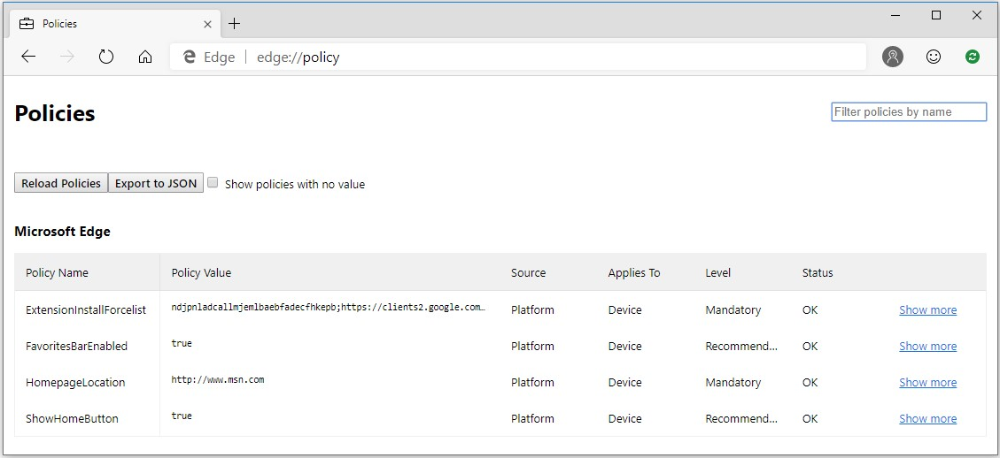
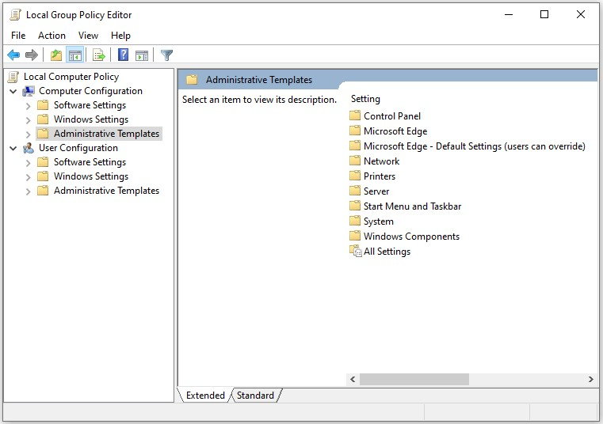

# Configure Microsoft Edge

Use the following information to configure Microsoft Edge on your Windows and Mac devices.

> [!NOTE]
> This article applies to Microsoft Edge version 77 or later.

## Configure Microsoft Edge on Windows

You can use group policy objects (GPO) to configure Microsoft Edge and managed Microsoft Edge updates on all versions of Windows. You can also provision policy through the registry for Windows devices that are joined to a Microsoft Active Directory domain or Windows 10 Pro or Enterprise instances enrolled for device management.

Microsoft Edge supports mandatory and recommended policies. Mandatory policies override user preferences and prevents the user from changing it, while recommended policy provide a default setting that may be overridden by the user. Most policies are mandatory only; a subset are mandatory and recommended. If both versions of a policy are set, the mandatory one takes precedents.

Microsoft Edge has two administrative templates: One to [configure Microsoft Edge settings](microsoft-edge-policies.md), and one to [manage Microsoft Edge updates](microsoft-edge-update-policies.md).

To get started, download and install the Microsoft Edge administrative template.

### 1. Download and install the Microsoft Edge administrative template

Go to the [Microsoft Edge Enterprise landing page](https://aka.ms/EdgeEnterprise) to download the Microsoft Edge administrative template file (policy_template.zip).

To add the administrative template to configure Microsoft Edge:

1. Open the _policy_template.zip_ file and go to **policy_templates** > **Windows** > **admx**.
2. Copy the _msedge.admx_ file to your Policy Definition template folder. (Example: C:\Windows\PolicyDefinitions)
3. In the _admx_ folder, open the appropriate language folder. For example, if you’re in the U.S., open the **en-US** folder.
4. Copy the _msedge.adml_ file to the matching language folder in your Policy Definition folder. (Example: C:\Windows\PolicyDefinitions\en-US)
5. To confirm the files loaded correctly either open Local Group Policy Editor directly (Windows key + R and enter gpedit.msc) or open MMC and load the Local Group Policy Editor snap-in. If an error occurs, it’s usually because the files are in an incorrect location.



<!--
To add the administrative template to manage Microsoft Edge updates:

1. Open the _policy_template.zip_ file and go to **updatepolicies**.
2. Copy the _msedgeupdate.admx_ file to your Policy Definition template folder. (Example: C:\Windows\PolicyDefinitions)
3. In the _updatepolicies_ folder, open the appropriate language folder. For example, if you’re in the U.S., open the **en-US** folder.
4. Copy the _msedgeupdate.adml_ file to the matching language folder in your Policy Definition folder. (Example: C:\Windows\PolicyDefinitions\en-US)
5. Open MMC and load the Local Group Policy Editor snap-in to confirm the files loaded correctly. If an error occurs, it’s usually because the files are in an incorrect location.

> [!NOTE]
> Currently the Microsoft Edge update policies are only localized in en-US. Additional language support will be added in a future release.
-->

### 2. Set mandatory or recommended policies

In Local Group Policy Editor, you can set mandatory or recommended policies to configure Microsoft Edge.

To configure a mandatory policy, open Local Group Policy Editor and go to **Administrative Templates** > **Microsoft Edge**.

To configure a recommended policy, open Local Group Policy Editor and go to **Administrative Templates** > **Microsoft Edge – Default Settings** (users can override).

### 3. Test your policies

On a target client device, open Microsoft Edge and navigate to **edge://policy** to see all policies that are applied. If the policies have not propagated to the test machine or user, try executing the following command from a command prompt to refresh policy settings on client device:

``` command
gpupdate /force
```



You can also use REGEDIT.exe on the client device to view the registry settings. The settings are located at the registry path **HKLM\SOFTWARE\Policies\Microsoft\Edge**.

## Configure Microsoft Edge on Mac
Use a property list (.plist) file to set Microsoft Edge policies on Mac. You then convert this file to a configuration profile that can be deployed to your user's Mac devices using your preferred management tool, such as Microsoft Intune [using custom settings](https://docs.microsoft.com/intune/custom-settings-macos) or Jamf.

You can create the plist file with any text editor. It's usually easier to edit a plist file using an editing tool that formats the XML code for you, such as _Xcode_, which is available for free from the [Apple developer website](https://developer.apple.com). After creating the contents of your plist file, you will need to name the file in a very specific way. The plist will need to contain the name of the application domain for Edge in reverse-domain format. For example, the required name for your plist for Dev channel is _com.microsoft.Edge.Dev.plist_.

> [!NOTE]
> The name is case sensitive and must match this name exactly.

For information about the policies available in Microsoft Edge, check out [Microsoft Edge - Policies](microsoft-edge-policies.md).

### Create a configuration profile

1. Go to the [Microsoft Edge Enterprise landing page](https://aka.ms/EdgeEnterprise) to download the _policy_template.zip_ file. The file contains a sample **plist** file that you can customize to define policy settings.
2. Open the zip file and go to the **policy_templates** > **examples** folder and make a copy of the _ITadminExample.plist_ file. This MCX .plist example file contains examples of every supported data type. For a list of supported policies and their preference key names, see [Microsoft Edge browser policies reference](microsoft-edge-policies.md).
3. Open the .plist file in your preferred editor. You can edit the file with any text editor. It's usually easier to edit a .plist file using an editing tool that formats the XML code for you, such as _Xcode_, which is available for free from the Apple developer website.
4. Make your changes and save the file with the correct domain name.
5. Convert your _com.microsoft.Edge.plist_ file to a configuration profile using your preferred conversion tool.

## See also

- [Overview of Microsoft Edge in the enterprise](overview-edge-in-the-enterprise.md)
- [Microsoft Edge Enterprise landing page](https://aka.ms/EdgeEnterprise)
