## Deploy Microsoft Edge for MacOS using Jamf
You can automate deployment of Microsoft Edge for MacOS using Jamf.

### Prerequisites

- Make sure that the Microsoft Edge PKG installation file, **MicrosoftEdgeDev-<version>.pkg** is in an accessible location on your network.
- Ensure that you have permissions and log in to your Jamf Cloud account.

To deploy Microsoft Edge for MacOS using Jamf:

1. Navigate to All Settings and click **Computer Management**.

    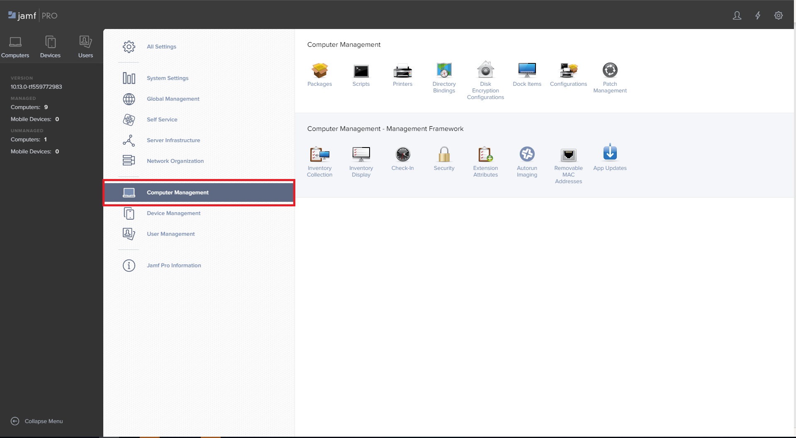

2. Click **Packages**.

    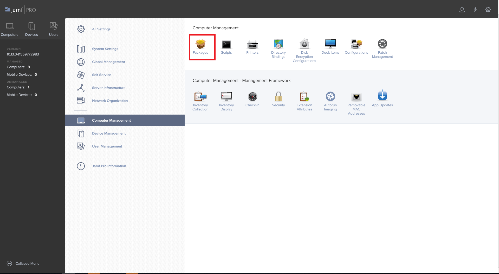

3. Click **New** to add a new package.

    

4. Enter the details of the new package and click **Save**.

    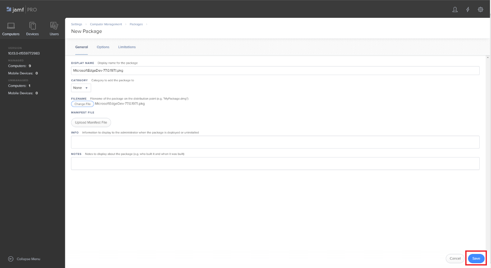

    The new Microsoft Edge package is displayed under Packages.

    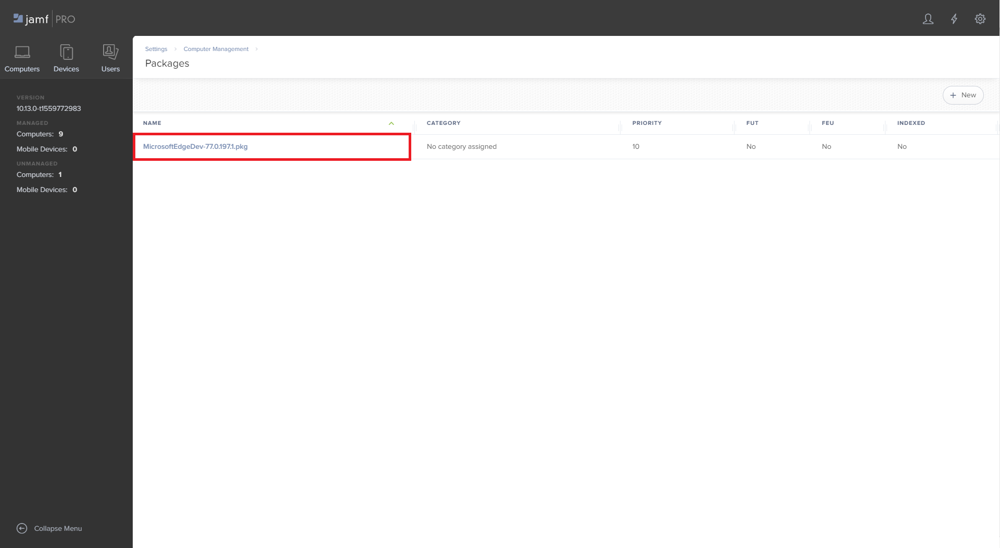

5. Navigate to **Computers**, select **Policies**, and then select **New**.
    - The new Policy pane is displayed.

    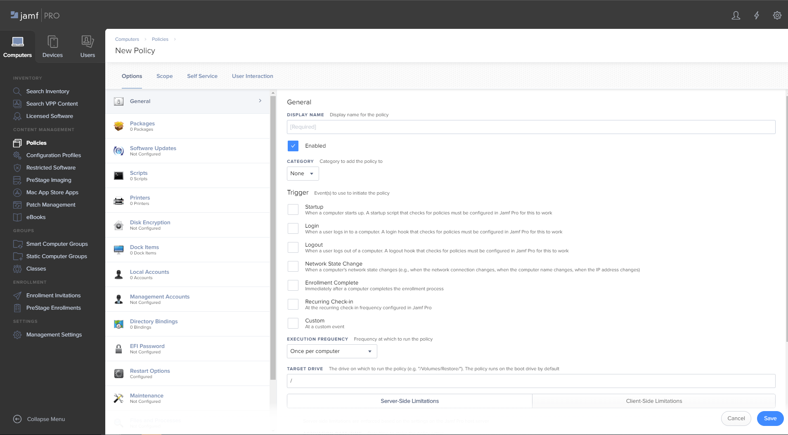

6. In the Options tab, select **General**.
    - Enter the display name for the policy.
    - Select the event to trigger the policy.

    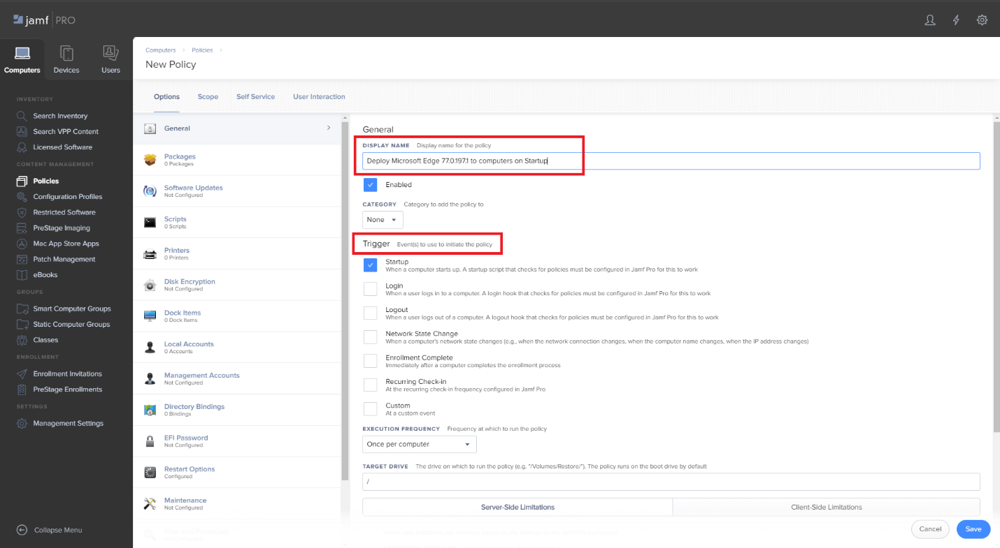

7. Under the Options tab, click **Packages**. Then click **Configure**.

    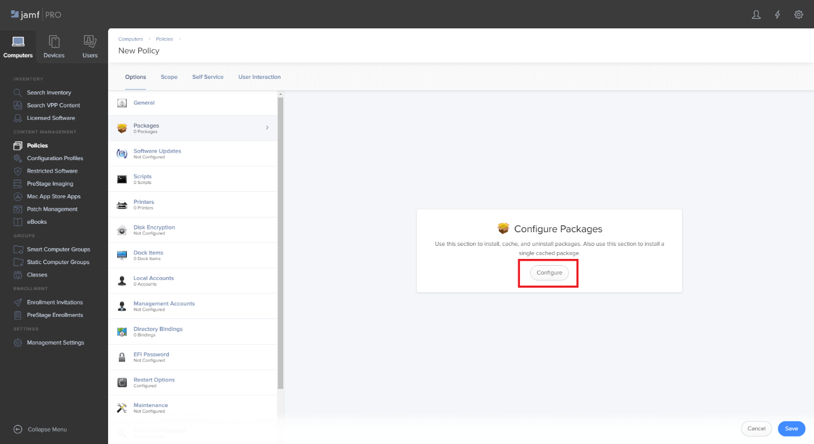

8. The package that you added earlier is displayed. Click **Add**.
    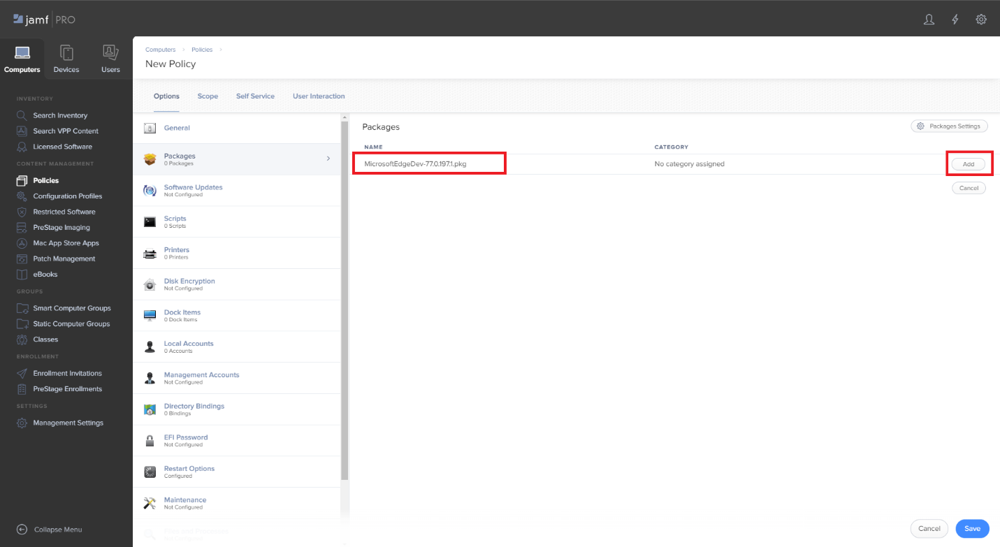

9. Select the distribution point and action, then click **Save**.
    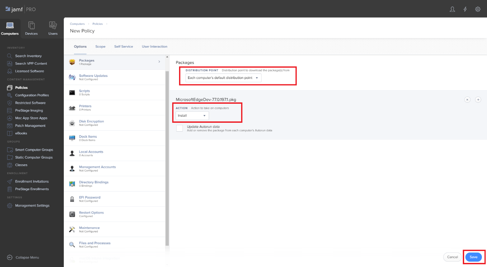

10. Click the **Scope** tab. From the TARGET COMPUTERS drop-down list, select the computers to deploy the package to. Click **Save**.
    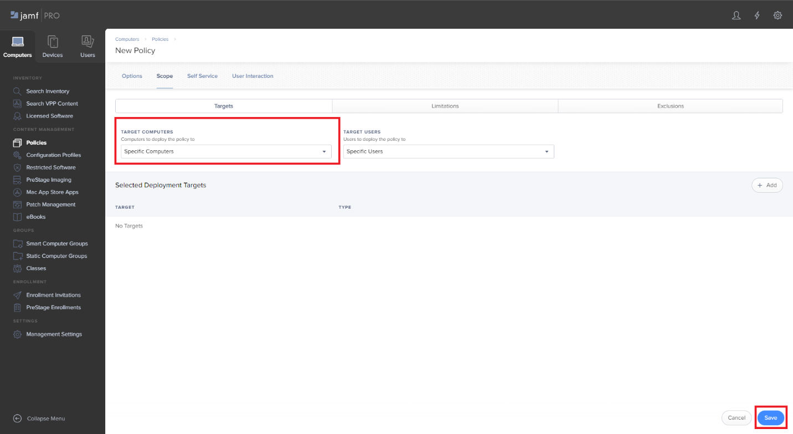

11. Click **Done**.
    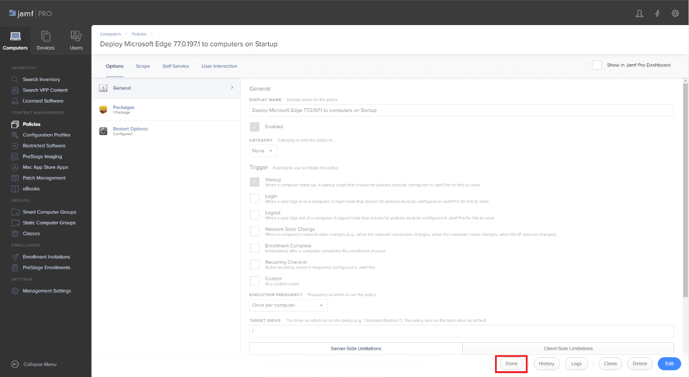

Congratulations! You’ve just finished deploying Microsoft Edge for MacOS using Jamf.

You will have the deployed Microsoft Edge package configured when the defined trigger condition is true.

## See also

- [Overview of Edge in the enterprise](overview-edge-in-the-enterprise.md)
- [Microsoft Edge Enterprise landing page](https://aka.ms/EdgeEnterprise)
- [Jamf.com](https://www.jamf.com/)
