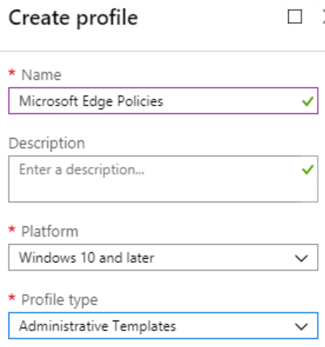
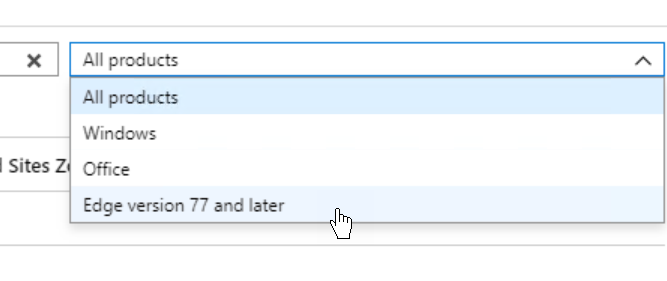
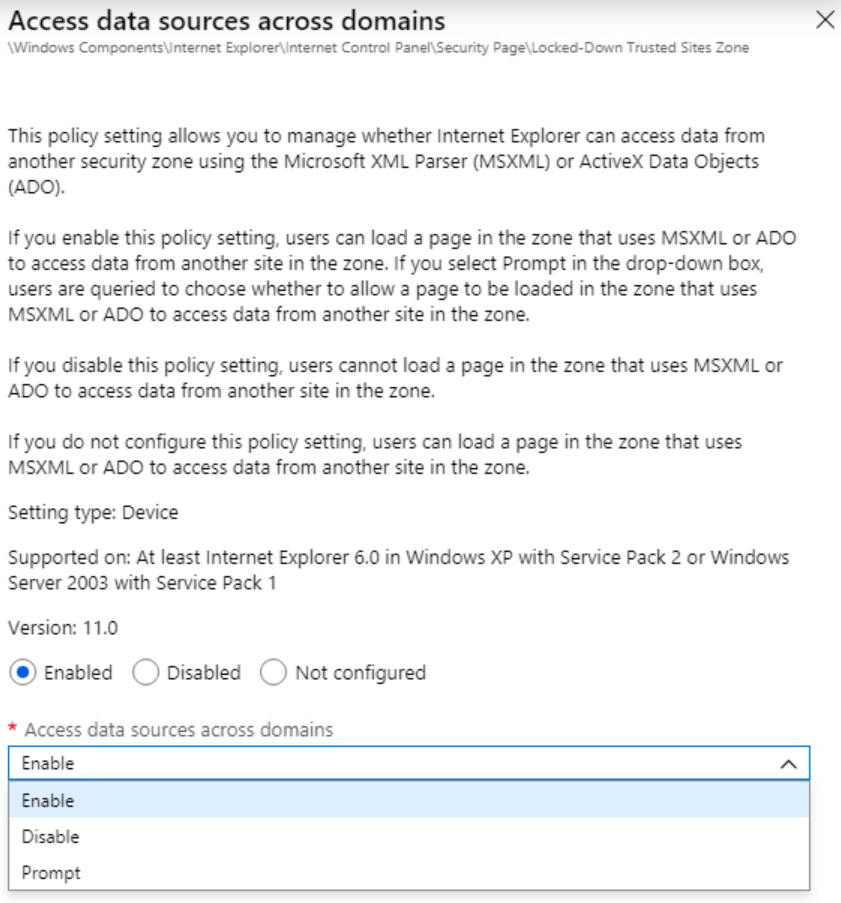

# Deploy Microsoft Edge using Microsoft Intune

This article shows you how to automate Microsoft Edge deployment and policy configuration for Windows 10 and macOS by using Microsoft Intune.

>[!NOTE]
>This article applies to Microsoft Edge version 77 or later.

You can deploy Microsoft Edge to Windows and macOS clients that are managed in your company's Intune tenant by adding apps containing the Microsoft Edge installation files to Intune. Like any Intune apps, you can configure app assignments to require Microsoft Edge deployment for selected users or devices. You can also make the app available in the Company Portal for users to install when they want to.

Additionally, you can configure Microsoft Edge policies and settings by adding a device configuration profile. Using Intune to manage and enforce policies is essentially equivalent to using Active Directory Group Policy or configuring local Group Policy Object (GPO) settings on user devices.

You can read [Manage web access by using Microsoft Edge with Microsoft Intune](https://docs.microsoft.com/en-us/intune/manage-microsoft-edge) to learn more, but keep in mind that the linked article is specific to Microsoft Edge version 45 and earlier and therefore may contain information and references that don't apply to Microsoft Edge Enterprise version 77 and later.

## Before you begin

- Review the information in [Add a Windows line-of-business app to Microsoft Intune](https://docs.microsoft.com/en-us/intune/lob-apps-windows).
- To create apps for **Windows 10**, download the Microsoft Edge Enterprise installation **.msi files** from the [Microsoft Edge Enterprise landing page](https://aka.ms/EdgeEnterprise). The installation files use the build channel and processor architecture in their names, and will have names like **MicrosoftEdgeDevEnterpriseX86.msi** or **MicrosoftEdgeBetaEnterpriseX64.msi**.
- To create apps for **macOS**, download the Microsoft Edge Enterprise **PKG for macOS** from the [Microsoft Edge Enterprise landing page](https://aka.ms/EdgeEnterprise).
- Make sure you store the Microsoft Edge installation files in an accessible local or network location.

## Add an app to deploy Microsoft Edge for Windows 10 to Intune

This procedure creates an app for deploying Microsoft Edge for Windows 10 in Intune.

>[!NOTE]
>You can only deploy Microsoft Edge with Mobile Device Management (MDM). Deploying with Mobile Application Management (MAM) isn't supported.

1. Sign in to the [Microsoft Azure portal](https://portal.azure.com).
2. Select **Intune** from _All Services_, or search for Intune in the portal search box.
3. From the _Microsoft Intune - Overview_ blade, select **Client apps** | **Apps**.

    

4. On the top command bar, select **Add**.
5. Initially, there's only one field named **App type**.

    

6. Select **Line-of-business app** from the drop-down list and additional fields are shown.

    

7. Select **App package file**, and use the file chooser to pick the .msi installation file. Information about the file will display under the file selection field. Click **OK** to continue.

    

8. Click **App information** and enter the following values:

    |Field  |Value  |
    |---------|---------|
    |Name     |This field is populated from the installer, but you can change it if you want          |
    |Description     |Enter a description         |
    |Publisher     |Microsoft         |
    |App install context     |This value is pre-selected and can't be modified         |
    |Ignore app version    |This slider should be set to yes for apps that are automatically updated like Microsoft Edge.    |
    |Category    |Optionally select a category    |
    |Display this as a featured app in the Company Portal    |Optionally set this to Yes    |
    |Information URL    |Optionally add a URL to a page containing information about the app, such as <https://aka.ms/EdgeEnterprise>    |
    |Privacy URL    |Optionally add a URL to a page containing app privacy information, such as <https://privacy.microsoft.com/en-US/privacystatement>    |
    |Command-line arguments    |Optional. See [Microsoft Edge proxy settings](edge-learnmore-cmdline-options-proxy-settings.md) for information about command-line arguments    |
    |Developer    |Optional    |
    |Owner    |Optional    |
    |Notes    |Optional    |
    |Logo    |Optionally select a logo from an image file    |

    

9. Optionally, select **Scope (Tags)** to apply existing tags for limiting deployment of the app to a specific scope.
10. Click **Add** to add the app.

When you're finished, see [Assign apps to groups with Microsoft Intune](https://docs.microsoft.com/en-us/intune/apps-deploy) to learn how to deploy the app to users.

**Other resources:**

- You can refer to the procedures in [Add a Windows line-of-business app to Microsoft Intune](https://docs.microsoft.com/en-us/intune/lob-apps-windows) for general guidance and additional details.
- See [Add apps to Microsoft Intune](https://docs.microsoft.com/en-us/intune/apps-add) for information about general Intune app considerations, organization and troubleshooting.

## Create a profile to manage settings in Microsoft Edge for Windows 10

Using Administrative Templates in Microsoft Intune, you can manage Microsoft Edge group policies on your Windows 10 devices using the cloud. This section will help you create a template to configure Microsoft Edge-specific application settings. When you create the template, it creates a device configuration profile. You can then assign or deploy this profile to Windows 10 devices in your organization.

### Prerequisites

- Windows 10 with the following minimum system requirements:
  - Windows 10, version 1903 with [KB4512941](https://support.microsoft.com/kb/4512941) installed
  - Windows 10, version 1809 with [KB4512534](https://support.microsoft.com/kb/4512534) installed
  - Windows 10, version 1803 with [KB4512509](https://support.microsoft.com/kb/4512509) installed
  <!-- - Windows 10, version 1709 with [KB?]() installed -->

The next procedure creates an Administrative Templates profile using Microsoft Edge policy settings built into Microsoft Intune.

1. Sign in to the [Microsoft Azure portal](https://portal.azure.com).
2. Select **Intune** from _All Services_, or search for Intune in the portal search box.
3. From the _Microsoft Intune - Overview_ blade, select **Device configuration** | **Profiles**.
4. On the top command bar, select **Create profile**.
5. Enter the following values:

    |Field  |Value  |
    |---------|---------|
    |Name     |Enter a descriptive name, like _Microsoft Edge Policies_         |
    |Description     |Optionally enter a description         |
    |Platform     |Windows 10 and later         |
    |Profile type     |Administrative Templates         |

    

6. Click **Settings** to show all the available settings.

    

7. On the right upper corner of the window, select the **All products** drop-down and then select **Edge version 77 or later** to filter the list to show only Edge settings.

    

8. To configure a setting, select it from the list and use the settings window on the right to enable and configure the setting.

    

9. Click **Create** to create the profile.

When you're finished, see [Assign user and device profiles in Microsoft Intune](https://docs.microsoft.com/en-us/intune/device-profile-assign) for information about how to assign the profile to your Azure Active Directory (Azure AD) user or device groups.

For more information about Windows 10 profiles, see [Use Windows 10 templates to configure group policy settings in Microsoft Intune](https://docs.microsoft.com/en-us/intune/administrative-templates-windows).

## Add an app to deploy Microsoft Edge for macOS to Intune

The process for adding Microsoft Edge for macOS is similar to the process for Windows devices, but there are certain prerequisites for managing macOS and iOS devices in Intune.

1. An Apple MDM Push certificate is required for Intune to manage iOS and macOS devices. If you haven't already configured Intune for the macOS, follow the instructions in [Get an Apple MDM push certificate](https://docs.microsoft.com/en-us/intune/apple-mdm-push-certificate-get).
2. Download the Microsoft Edge Enterprise **PKG for macOS** from the [Microsoft Edge Enterprise landing page](https://aka.ms/EdgeEnterprise).

    

3. You must pre-process your .pkg file before you can upload the Microsoft Edge for macOS installation file to Microsoft Intune. Follow the instructions in [Deploy Microsoft Edge for macOS using Microsoft Intune](deploy-edge-to-the-mac.md#deploy-microsoft-edge-for-macos-using-microsoft-intune) to pre-process the file and add the app to Intune. You can refer to the instructions in the [Add Microsoft Edge for Windows to Intune](#add-an-app-to-deploy-microsoft-edge-for-windows-10-to-intune) section for information specific to Microsoft Edge.

    >[!NOTE]
    >The pre-processing of the .pkg file must take place on a macOS device.

4. Follow the instructions in [Assign apps to groups with Microsoft Intune](https://docs.microsoft.com/en-us/intune/apps-deploy) to learn how to deploy the app to users.
5. You can create custom settings for your macOS devices in Intune by creating a custom profile. Follow the instructions in [Use custom settings for macOS devices in Microsoft Intune](https://docs.microsoft.com/en-us/intune/custom-settings-macos) to create a custom profile for macOS devices.

## See also

- [Overview of Microsoft Edge in the enterprise](overview-edge-in-the-enterprise.md)
- [Microsoft Edge Enterprise landing page](https://aka.ms/EdgeEnterprise)
- [Manage web access by using Microsoft Edge with Microsoft Intune](https://docs.microsoft.com/en-us/intune/manage-microsoft-edge)
- [Use Windows 10 templates to configure group policy settings in Microsoft Intune](https://docs.microsoft.com/en-us/intune/administrative-templates-windows)
- [Add apps to Microsoft Intune](https://docs.microsoft.com/en-us/intune/apps-add)
- [Add a Windows line-of-business app to Microsoft Intune](https://docs.microsoft.com/en-us/intune/lob-apps-windows)
- [Assign apps to groups with Microsoft Intune](https://docs.microsoft.com/en-us/intune/apps-deploy)
- [Deploy Microsoft Edge for macOS using Microsoft Intune](deploy-edge-to-the-mac.md#deploy-microsoft-edge-for-macos-using-microsoft-intune)
- [Use custom settings for macOS devices in Microsoft Intune](https://docs.microsoft.com/en-us/intune/custom-settings-macos)
