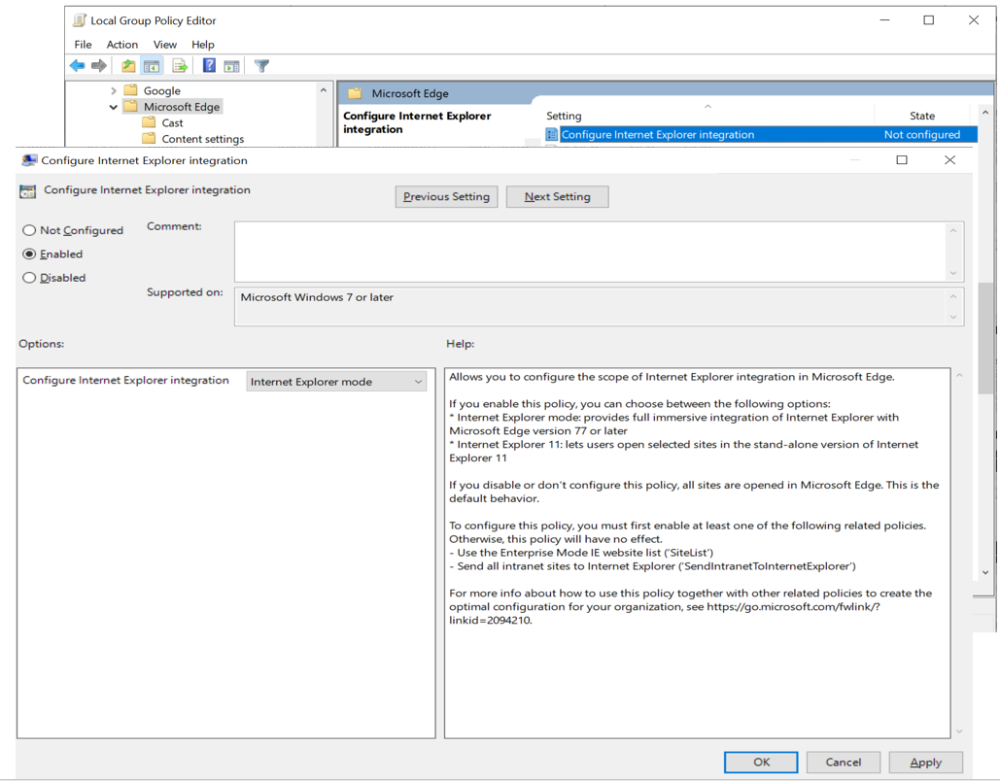
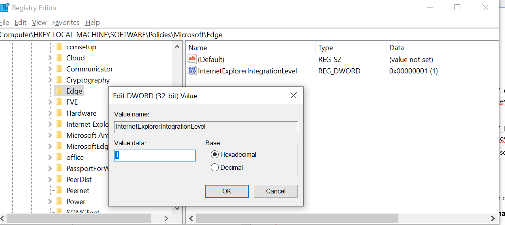
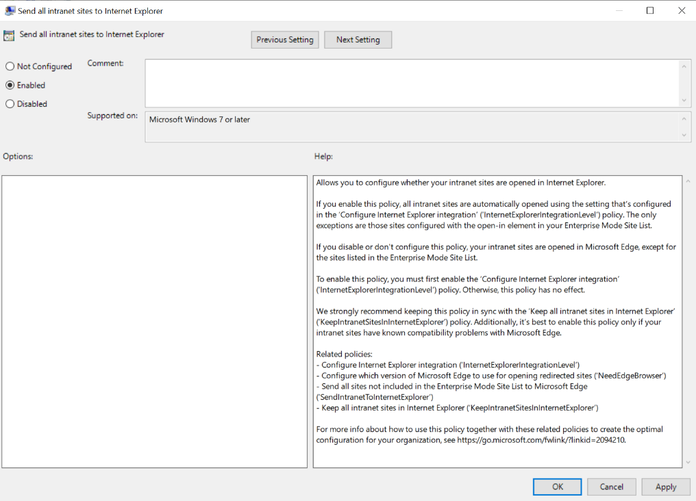

**Use Microsoft Edge with Internet Explorer mode**

**Applies to:**

- Windows 10 with the following minimum system requirements:
  - Windows 10, version 1903 with the latest cumulative updates ([KB4503293](https://support.microsoft.com/en-us/help/4503293) or higher) and security update [KB4501375](https://support.microsoft.com/en-us/help/4501375) or higher
  - Windows 10, version 1809 with latest cumulative update ([KB4509479](https://support.microsoft.com/en-us/help/4509479) or higher)
- Microsoft Edge version 77 and later

### What is Internet Explorer mode?

Internet Explorer mode on Microsoft Edge is a simplified experience that combines a modern rendering engine and compatibility with legacy sites that require Internet Explorer in a single browser. Internet Explorer mode provides an integrated browsing experience in Microsoft Edge, using the integrated Chromium engine for modern sites and leveraging Internet Explorer 11 (IE11) for legacy sites that require the Trident MSHTML engine.

Internet Explorer mode is policy enabled and applies to:

- Sites listed in the **Use the Enterprise Mode IE website list** Internet Explorer group policy
- Intranet sites that have **Send all intranet sites to Internet Explorer** Microsoft Edge 77 or later group policy enabled

>[!NOTE]
> If you want to configure your Enterprise Mode Site List, see the [Use the Enterprise Mode Site List Manager](https://docs.microsoft.com/en-us/internet-explorer/ie11-deploy-guide/use-the-enterprise-mode-site-list-manager) and [Add multiple sites to the Enterprise Mode site list using a file and the Enterprise Mode Site List Manager (schema v.2)](https://docs.microsoft.com/en-us/internet-explorer/ie11-deploy-guide/add-multiple-sites-to-enterprise-mode-site-list-using-the-version-2-schema-and-enterprise-mode-tool) articles.

**Internet Explorer mode supports:**

- All document modes and enterprise modes.
- ActiveX controls
- Browser Helper Objects
- Internet Explorer settings and Group Policies that affect the security zone settings and Protected Mode
- F12 chooser
- (Limited functionality) Microsoft Edge extensions

**Internet Explorer mode does not support:**

- Internet Explorer toolbars
- Internet Explorer settings and Group Policies that affect the navigation menu (search engines, home pages and so on)
- IE11 or Microsoft Edge F12 developer tools

## Turn on Internet Explorer mode using Group Policy

1. Open Local Group Policy Editor.
1. Click **Administrative Templates** > **Windows Components** > **Microsoft Edge**.
1. Double-click **Configure Internet Explorer integration**.
1. Select **Enabled**.
1. In the Options area, choose **Internet Explorer mode**.

    

## Turn on Internet Explorer mode using the registry

To turn on Internet Explorer mode using the registry, perform the following:

- **For only the local user:**

    Open a registry editor, like regedit.exe and go to **HKEY\_CURRENT\_USER\Software\Policies\Microsoft\Edge\InternetExplorerIntegrationLevel**.

- **For all users on the device:**

1. Open a registry editor such as regedit.exe and go to **HKEY\_LOCAL\_MACHINE\Software\Policies\Microsoft\Edge\InternetExplorerIntegrationLevel**.

2. Edit the _InternetExplorerIntegrationLevel_ registry key and add the value **1**.  For example:

    

## Possible scenarios and configurations

If you find yourself in any of the following scenarios, follow the procedure for the given configuration.

### Single browser or two-browser experience in a non-managed environment

In this scenario, you can use the Group Policy editor to set sites to open in Internet Explorer mode.

1. Open Local Group Policy Editor.
1. Click **Administrative Templates** > **Windows Components** > **Microsoft Edge**.
1. Double-click **Send all intranet sites to Internet Explorer**.
1. Select **Enabled**.

    

> [!NOTE]
> - The group policy best applies for the user scenarios where we don't have a site list configured.
> - Sites listed in the Enterprise Site List XML will have higher priority.
> - We consider that most of the legacy sites are under the Local Intranet Zone.

### Two-browser experience in a managed environment

In this scenario, the IT department has deployed a Site List XML file and already enabled the Internet Explorer group policy **Use the Enterprise Mode IE website list**, also known as the Site List XML (schema v.2). We will leverage that configuration and all sites that have the element _\<open-in\>IE11\</open-in\>_ will now open sites in Internet Explorer mode.

> [!NOTE]
> Enterprise Mode schema v.1 will not be supported for Internet Explorer mode integration. If you are using schema v.1, you must upgrade to schema v.2 or v.2.1. See [Enterprise Mode schema v.2 guidance](https://docs.microsoft.com/en-us/internet-explorer/ie11-deploy-guide/enterprise-mode-schema-version-2-guidance).

Recommended configuration: HTTPS location: **[https://localhost:8080/sites.xml](https://localhost:8080/sites.xml)**

### Other available configurations

- Local network: **[\\\network\shares\sites.xml](./../../\\network\shares\sites.xml)**
- Local file: **file:///c:\\Users\\\<user\>\\Documents\\testList.xml**

All your managed devices must have access to this location if you want them to be able to access and use Enterprise Mode and your site list. For information about how to create and use an Enterprise Mode site list, see [Use the Enterprise Mode Site List Manager](https://docs.microsoft.com/en-us/internet-explorer/ie11-deploy-guide/use-the-enterprise-mode-site-list-manager).

> [!IMPORTANT]
> If you're running version 2.0 (v.2) of the schema, you can continue to do so, but you won't get the additional functionality detailed in the updated schema elements.

## Updated schema elements

The following table provides the additional element added to the v.2 of the Enterprise Mode schema:

| **Element** | **Description** |
| --- | --- |
| \<open-in app=**true**\> | A child element that controls what browser is used for sites. This element supports the  **Open in IE11**  or  **Open in Microsoft Edge**  experiences, for devices running Windows 10. |

**Example:**

``` xml
<site url=**contoso.com**>

  <open-in app=**true**>IE11</open-in>

</site>
```

The following table shows the possible values of the \<open-in\> element:

| **Value** | **Description** |
| --- | --- |
| **\<open-in\>IE11\</open-in\>** | Opens the site in Internet Explorer mode, regardless of which browser is opened by the employee. |
| **\<open-in app=**true**\>IE11\</open-in\>** | Opens the site in IE11, regardless of which browser is opened by the employee. |
| **\<open-in\>MSEdge\</open-in\>** | Opens the site in Microsoft Edge, regardless of which browser is opened by the employee. |
| **\<open-in\>None or not specified\</open-in\>** | Opens in whatever browser the employee chooses. |

> [!NOTE]
> The element of app=**true** is only recognized when associated to _'open-in' IE11_. Adding it to the other 'open-in' elements won't change the behavior. We recommend following the structure mentioned above.

### Additional configurations

If you have identified a site that needs to run in IE11, from business or technical reasons you can update the site list to set the specific website with the following structure.

``` xml
<site url=**contoso.com**>

  <open-in app=**true**>IE11</open-in>

</site>
```

If you want to restrict users from using IE11, do the following:

1. Open Local Group Policy Editor.
1. Click **Administrative Templates** > **Windows Components** > **Internet Explorer**.
1. Double-click **Send all sites not included in the Enterprise Mode Site List to Microsoft Edge**.
1. Select **Enabled**.

## Frequently Asked Questions

### How do I know if a site is loading in Internet Explorer mode?

When a site loads in Internet Explorer mode, the IE logo indicator displays on the left side of navigation bar. You can click the IE logo indicator to display additional information.

  

### Will IE mode replace Internet Explorer 11?

We're committed to keeping Internet Explorer a supported, reliable, and safe browser. Internet Explorer is still a component of Windows and follows the support lifecycle of the OS on which it's installed. For details, see [Lifecycle FAQ - Internet Explorer](https://support.microsoft.com/help/17454/). While we continue to support and update Internet Explorer, the latest features and platform updates will only be available in Microsoft Edge.

## See also

- [Overview of Microsoft Edge in the enterprise](overview-edge-in-the-enterprise.md)
- [Microsoft Edge Enterprise landing page](https://aka.ms/EdgeEnterprise)
