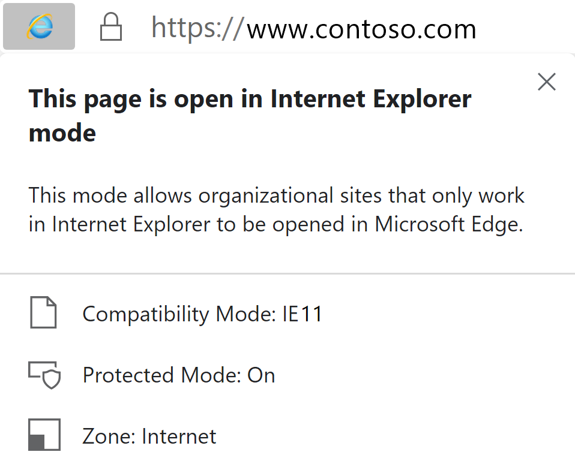
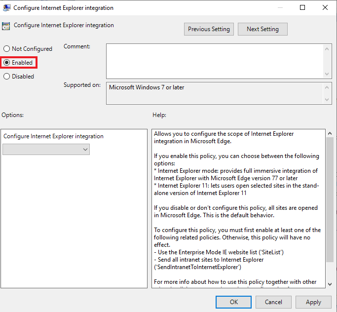
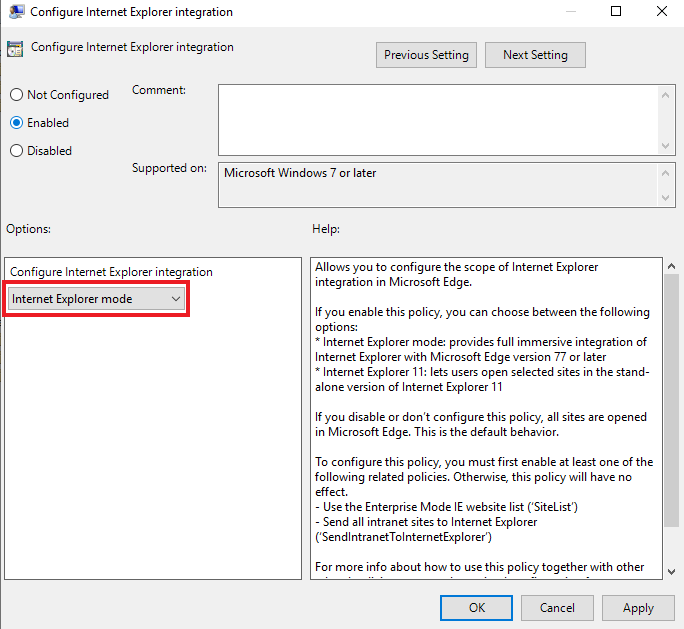
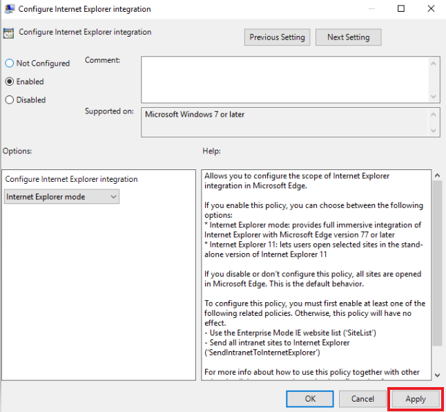
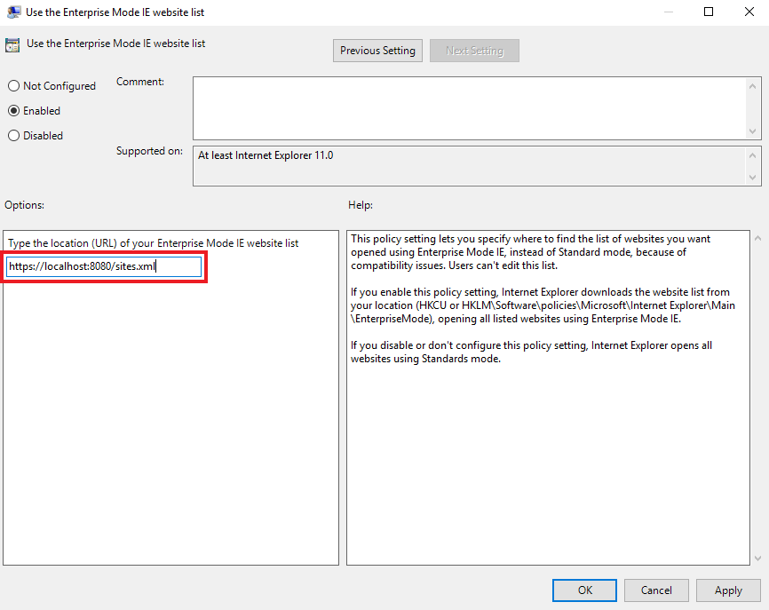
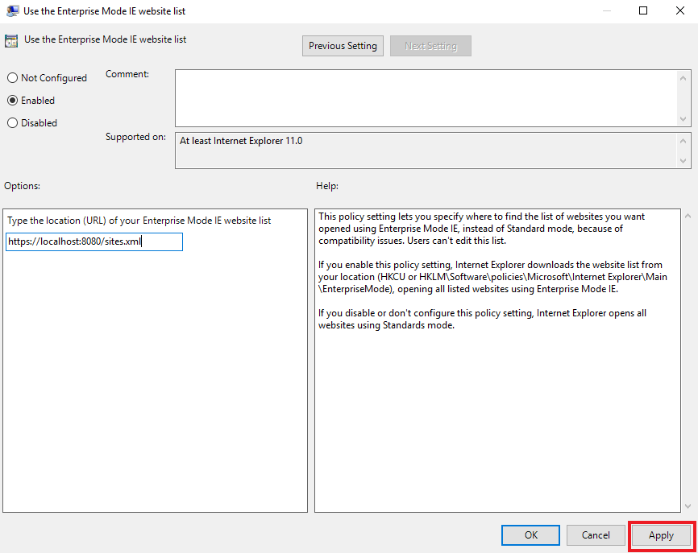
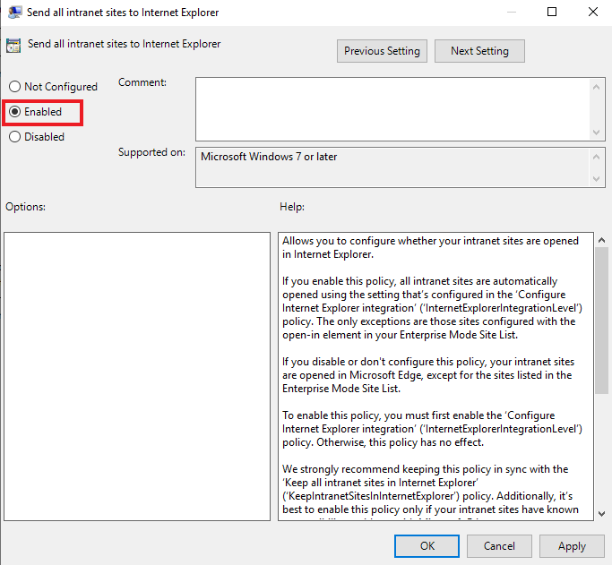

# Use Microsoft Edge with IE mode

This article explains how to use Microsoft Edge with IE mode.

> [!NOTE]
> This article applies to Microsoft Edge **Stable**, **Beta** and **Dev** Channels, version 77 or later.

## Prerequisites

The following prerequisites apply to using Microsoft Edge with IE mode.

> [!IMPORTANT]
> To ensure success, install the latest updates for Windows and Microsoft Edge. Failure to do so will likely cause IE mode to fail.

1. The minimum system updates for the operating systems listed in the next table.


| Operating system | Version       | Updates |
|------------------|---------------|---------|
| Windows 10       | 1909 or later |         |
| Windows 10       | 1903          | [KB4501375](https://support.microsoft.com/help/4501375/windows-10-update-kb4501375) or later |
| Windows Server   | 1903          | [KB4501375](https://support.microsoft.com/help/4501375/windows-10-update-kb4501375) or later |
| Windows 10       | 1809          | [KB4501371](https://support.microsoft.com/help/4501371/windows-10-update-kb4501371) or later |
| Windows Server   | 1809          | [KB4501371](https://support.microsoft.com/help/4501371/windows-10-update-kb4501371) or later |
| Windows Server   | 2019          | [KB4501371](https://support.microsoft.com/help/4501371/windows-10-update-kb4501371) or later |
| Windows 10       | 1803          | [KB4512509](https://support.microsoft.com/help/4512509/windows-10-update-kb4512509) or later |
| Windows 10       | 1709          | [KB4512494](https://support.microsoft.com/help/4512494/windows-10-update-kb4512494) or later |
| Windows 10       | 1607          | [KB4516061](https://support.microsoft.com/help/4516061/windows-10-update-kb4516061) or later |
| Windows Server   | 2016          | [KB4516061](https://support.microsoft.com/help/4516061/windows-10-update-kb4516061) or later |
| Windows 10       | initial version, July 2015 | [KB4520011](https://support.microsoft.com/help/4520011/windows-10-update-kb4520011) or later |
| Windows 8       | 8.1              | [KB4507463](https://support.microsoft.com/help/4507463/july-16-2019-kb4507463-os-build-preview-of-monthly-rollup) or later; or [KB4511872](https://support.microsoft.com/help/4511872/cumulative-security-update-for-internet-explorer) or later |
| Windows Server   | 2012 R2       | [KB4507463](https://support.microsoft.com/help/4507463/july-16-2019-kb4507463-os-build-preview-of-monthly-rollup) or later; or [KB4511872](https://support.microsoft.com/help/4511872/cumulative-security-update-for-internet-explorer) or later |
| Windows 8  | Embedded            | Install [KB4492872](https://support.microsoft.com/help/4492872/update-for-internet-explorer-april-16-2019) to upgrade to Internet Explorer 11; then install [KB4507447](https://support.microsoft.com/help/4507447/windows-server-2012-update-kb4507447) or later; or [KB4511872](https://support.microsoft.com/help/4511872/cumulative-security-update-for-internet-explorer) or later |
| Windows Server   | 2012           | Install [KB4492872](https://support.microsoft.com/help/4492872/update-for-internet-explorer-april-16-2019) to upgrade to Internet Explorer 11; then install [KB4507447](https://support.microsoft.com/help/4507447/windows-server-2012-update-kb4507447) or later; or [KB4511872](https://support.microsoft.com/help/4511872/cumulative-security-update-for-internet-explorer) or later |
| Windows 7        |  SP1**        | [KB4507437](https://support.microsoft.com/help/4507437/windows-7-update-kb4507437) or later; or [KB4511872](https://support.microsoft.com/help/4511872/cumulative-security-update-for-internet-explorer) or later |
| Windows Server   |  2008 R2**    | [KB4507437](https://support.microsoft.com/help/4507437/windows-7-update-kb4507437) or later; or [KB4511872](https://support.microsoft.com/help/4511872/cumulative-security-update-for-internet-explorer) or later |


   > [!IMPORTANT]
   > ** Windows 7 and Windows Server 2008 R2 will be supported by Microsoft Edge even after those operating systems go out of support. In order for IE mode to be supported on these operating systems the devices will need to have the [Extended Security Updates for Windows 7](https://support.microsoft.com/help/4527878/faq-about-extended-security-updates-for-windows-7). We recommend that you upgrade to a supported operating system as soon as possible in order to remain secure. Support for Microsoft Edge with the Extended Security Updates should be considered a temporary bridge to getting to a supported OS state.

2. The Microsoft Edge administrative template. For more information, see [Configure Microsoft Edge](https://docs.microsoft.com/DeployEdge/configure-microsoft-edge).

3. Internet Explorer 11 enabled in Windows Features.

## What is IE mode?

IE mode on Microsoft Edge is a simplified experience that combines a modern rendering engine and compatibility with legacy sites that require Internet Explorer in a single browser. IE mode provides an integrated browsing experience in Microsoft Edge, using the integrated Chromium engine for modern sites and leveraging Internet Explorer 11 (IE11) for legacy sites that require the Trident MSHTML engine.

When a site loads in IE mode, the IE logo indicator displays on the left side of navigation bar. You can click the IE logo indicator to display additional information.

  

IE mode is policy enabled and applies to:

- Sites listed in these group policies:
  - Internet Explorer, "Use the Enterprise Mode IE website list"
  - Microsoft Edge 78 or later, "Configure the Enterprise Mode Site List"
- Intranet sites that have the **Send all intranet sites to Internet Explorer** group policy enabled (Microsoft Edge 77 or later.)

### IE mode supports the following Internet Explorer functionality

- All document modes and enterprise modes
- ActiveX controls (such as Java or Silverlight)
- Browser Helper Objects 
- Internet Explorer settings and Group Policies that affect the security zone settings and Protected Mode
- [IEChooser](https://docs.microsoft.com/office/dev/add-ins/testing/debug-add-ins-using-f12-developer-tools-on-windows-10)
- Microsoft Edge extensions (Extensions that interact with the IE page content directly are not supported.)

### IE mode doesn't support the following Internet Explorer functionality

- Internet Explorer toolbars
- Internet Explorer settings and Group Policies that affect the navigation menu (for example - search engines, and home pages.)
- IE11 or Microsoft Edge F12 developer tools

## Enable IE mode

Use the following steps to enable IE mode.

> [!NOTE]
> Policies to enable IE mode can be configured through Intune. For more information, see [Add Microsoft Edge to Microsoft Intune](https://docs.microsoft.com/intune/apps/apps-windows-edge?toc=https://docs.microsoft.com/DeployEdge/toc.json&bc=https://docs.microsoft.com/DeployEdge/breadcrumb/toc.json) and [Configure Microsoft Edge policies with Microsoft Intune](https://docs.microsoft.com/DeployEdge/configure-edge-with-intune).


### Enable IE mode using Group Policy

1. Download and use the latest [Microsoft Edge Policy Template](https://docs.microsoft.com/DeployEdge/configure-microsoft-edge).
2. Open Local Group Policy Editor.
3. Click **Computer Configuration** > **Administrative Templates** > **Microsoft Edge**.
4. Double-click **Configure Internet Explorer integration**.

    

5. Select **Enabled**.

    

6. Under **Options**, set the dropdown value to 
   -  **Internet Explorer mode** if you want sites to open in IE mode on Edge
   -  **Internet Explorer 11** if you want sites to open in a standalone Internet Explorer 11 window
   -  **None** if you want to disable Internet Explorer mode when it is set via edge://flags or through command line options.

   > [!NOTE]
   > Setting the policy to **Disabled** implies IE mode is disabled by policy, but can be set through edge://flags or command line options.

    

7. Click **OK** or **Apply** to save this policy setting.

   >[!NOTE]
   >Enterprise Mode schema v.1 isn't supported for IE mode integration. If you are currently using schema v.1 with Internet Explorer 11, you must upgrade to schema v.2. For more information, see [Enterprise Mode schema v.2 guidance](https://docs.microsoft.com/internet-explorer/ie11-deploy-guide/enterprise-mode-schema-version-2-guidance).

<!--
    -->

### Configure which sites should open in IE mode

There are 2 options for identifying which sites should open in IE mode:

- (Recommended) [Configure sites on the Enterprise Site list](#configure-sites-on-the-enterprise-site-list)
- [Configure all Intranet sites](#configure-all-intranet-sites)

## Configure sites on the Enterprise Site list

You can use the following group policies to configure specific sites to open in IE mode:

- **Use the Enterprise Mode IE website list** (Internet Explorer)
- **Configure the Enterprise Mode Site List** (Microsoft Edge, version 78 or later)<br/>This policy lets you create a separate Enterprise Mode Site list. Enabling this policy overrides the settings in the "Use the Enterprise Mode IE website list" policy, provided that "Configure Internet Explorer integration" is enabled. Disabling or not configuring this policy doesn't affect the default behavior of the "Configure Internet Explorer integration" policy.

For more information about Enterprise Mode Site lists, see:

- [Use the Enterprise Mode Site List Manager](https://docs.microsoft.com/internet-explorer/ie11-deploy-guide/use-the-enterprise-mode-site-list-manager)
- [Add multiple sites to the Enterprise Mode site list using a file and the Enterprise Mode Site List Manager (schema v.2)](https://docs.microsoft.com/internet-explorer/ie11-deploy-guide/add-multiple-sites-to-enterprise-mode-site-list-using-the-version-2-schema-and-enterprise-mode-tool).

### To configure the "Use the Enterprise Mode IE website list" policy:

1. Create or re-use a Site List XML
    1. All sites that have the element _\<open-in\>IE11\</open-in\>_ will now open in IE mode.
2. Open Group Policy Editor.
3. Click **Computer Configuration** > **Administrative Templates** > **Windows Components** > **Internet Explorer**.
4. Double-click **Use the Enterprise Mode IE website list**.

    

5. Select **Enabled**.

    

6. Under **Options**, type the location of website list. You can use one of the following locations:

    - (Recommended) HTTPS location: **https://localhost:8080/sites.xml**
    - Local network file: **\\\network\shares\sites.xml**
    - Local file: **file:///c:/Users/\<user\>/Documents/sites.xml**

    

7. Click **OK** or **Apply** to save these settings.

    

### To configure the "Configure the Enterprise Mode Site List" policy:

> [!NOTE]
> This policy lets you create a separate Enterprise Mode Site list. Enabling this policy overrides the settings in the "Use the Enterprise Mode IE website list" policy, provided that "Configure Internet Explorer integration" is enabled. Disabling or not configuring this policy doesn't affect the default behavior of the "Configure Internet Explorer integration" policy.

1. Create or re-use a Site List XML
    1. All sites that have the element _\<open-in\>IE11\</open-in\>_ will now open in IE mode.
2. Open Group Policy Editor.
3. Click **Computer Configuration** > **Administrative Templates** > **Microsoft Edge**.
4. Double-click **Configure the Enterprise Mode Site List**.

    

5. Select **Enabled**.

    

6. Under **Options**, type the location of website list. You can use one of the following locations:

    - (Recommended) HTTPS location: **https://localhost:8080/sites.xml**
    - Local network file: **\\\network\shares\sites.xml**
    - Local file: **file:///c:/Users/\<user\>/Documents/sites.xml**

    

7. Click **OK** or **Apply** to save these settings.

    

## Configure all intranet sites

>[!NOTE]
>
> - This group policy may be most appropriate for an organization that doesn't currently deploy a custom site list but requires IE11 for the majority of its intranet sites.
> - This policy will be most effective when most of an organization's legacy sites are in the Local Intranet Zone.
> - If you also deploy a custom site list, the configuration in the site list takes precedence over this policy.
>

1. Open Local Group Policy Editor.
2. Click **Computer Configuration** > **Administrative Templates** > **Microsoft Edge**.
3. Double-click **Send all intranet sites to Internet Explorer**.

    

4. Select **Enabled**, and then click **OK** or **Apply** to save the policy settings.

    

### Updated schema elements

The following table describes the \<open-in app\> element added to the v.2 of the Enterprise Mode schema:

| **Element** | **Description** |
| --- | --- |
| \<open-in app="**true**"\> | A child element that controls what browser is used for sites. This element is required for sites that need to **open in IE11**.|

**Example:**

``` xml
<site url="contoso.com">

  <open-in app="true">IE11</open-in>

</site>
```

The following table shows the possible values of the \<open-in\> element:

| **Value** | **Description** |
| --- | --- |
| **\<open-in\>IE11\</open-in\>** | Opens the site in IE mode, when the user is in Microsoft Edge and "Configure Internet Explorer integration" is set to Enabled with the option "Internet Explorer mode". <br> Opens the site in Internet Explorer 11, when the user is in Microsoft Edge and "Configure Internet Explorer integration" is set to Enabled with the option "Internet Explorer 11". |
| **\<open-in app="**true**"\>IE11\</open-in\>** | Opens the site in IE11, regardless of which browser is opened by the user. |
| **\<open-in\>MSEdge\</open-in\>** | Opens the site in Microsoft Edge, regardless of which browser is opened by the user. |
| **\<open-in\>None or not specified\</open-in\>** | Opens the site in the default browser or in the browser where navigation was initiated. |

>[!NOTE]
> The attribute app=**"true"** is only recognized when associated to _'open-in' IE11_. Adding it to the other 'open-in' elements won't change browser behavior.   

### Configure neutral sites

In order for IE mode to work properly, authentication/ Single Sign-On servers will need to be explicitly configured as neutral sites. Otherwise, IE mode pages will try to redirect to Microsoft Edge (which is expected behavior for any site not on the site list), causing authentication to fail. This will result in a message to the user that they are not authenticated or in most cases, result an infinite authentication loop. 

Navigation to a neutral site will remain where it started - either in Microsoft Edge or in IE mode. Additionally, configuring neutral sites ensures that modern applications using the same authentication servers are not impacted. 

You can configure neutral sites by setting the *Open In* dropdown to 'None' in the Enterprise Mode Site List Manager tool or by directly updating the site list XML:

``` xml
<site url="login.contoso.com">
   
    <open-in>None</open-in>

</site>
```

To identify authentication servers, you can inspect the site in standalone IE11 with Developer Tools. If you need time to identify your authentication servers, you can configure a policy to ensure that all in-page navigations from IE mode remain in IE mode. It is recommended that you revisit this setting once you have identified and added your authentication servers to the site list. For more information, see [Configure in-page navigations to remain in IE mode](https://docs.microsoft.com/deployedge/microsoft-edge-policies#internetexplorerintegrationsiteredirect).

## Troubleshoot IE mode

Use the information in this section to diagnose and fix IE mode problems.

### Internet Explorer mode diagnostic information

You can get Internet Explorer mode diagnostic information on the Microsoft Edge Compatibility tab. To open this tab and see the Internet Explorer mode diagnostics page, go to *edge://compat/iediagnostic*. In addition to providing configuration information for the following categories, this page also gives actionable diagnostic messages.

- **Registry key check**. Checks to see if Internet Explorer is set up in the registry. If it isn't, the user will see a prompt to fix the issue. They can click **Fix it** to resolve the problem.
- **Internet Explorer mode**. The number **7** relates to the API version that's used, based on the configuration and OS. This is another setting that can generate an actionable diagnostic, and the user is prompted to install a **Windows Update**.
- **Internet Explorer mode setting**. This setting is turned on, using default integration and Internet Explorer mode integration policy.
- **Command line**. Shows the command line string and switches used to start Microsoft Edge. In this example, the path statement shows that Microsoft Edge is installed at the user level, and a Tab feature (Experiment) is enabled.
- **Group policy settings**. Turned on and using the Enterprise Mode IE website list (set as IE policy). At this stage the list is still pointing to a file share instead of *https://localhost/sites.xml*, the recommended configuration.<br>
Other settings, such as the Site list debug registry key, and the Enterprise mode site list (set as Microsoft Edge policy) aren't set.

### Error message: "To open this page in Internet Explorer mode, reinstall Microsoft Edge with administrator privileges."

You are receiving the message because you are missing the required updates. Please see the [prerequisites section](#prerequisites) for the required versions of Windows and Microsoft Edge.

Microsoft Edge version 77 or later needs to be installed at the system level, and Internet Explorer 11 needs to be enabled in Windows Features.

Possible reasons for this error:

- Microsoft Edge Canary is installed at the user level and doesn't prompt for elevation.
- Microsoft Edge Dev, Beta will prompt for elevation but if you cancel the elevation, the installation will be continue at the user level.
- Internet Explorer 11 has been disabled in Windows Features.

Possible solutions:

- Run the installer for any channel at the system level: `installer.exe --system-level`.
- Enable Internet Explorer 11 in Windows Features.

To check that Microsoft Edge is installed at the systems level, type "edge://version" in the Microsoft Edge address bar. The Executable path will show a path starting with *C:\Program Files...*, which indicates a system install. If the Executable path begins with *C:\Users..*, uninstall and then reinstall Microsoft Edge with administrator privileges.

### Error message: "To open this page in IE mode, try restarting Microsoft Edge."

You're receiving this message because there was an unexpected error encountered in the Internet Explorer process. This should be resolved by restarting Microsoft Edge.

### Error message: "Turn off remote debugging to open this site in IE mode otherwise it might not work as expected."

You're receiving the message because you started remote debugging and you navigated to a web page that your organization has configured to run in IE mode.

If the intention is to run remote debug on this page you can continue to do so, but the webpage will be rendered in the Microsoft Edge engine.

## Frequently Asked Questions

### Will IE mode replace Internet Explorer 11?

We're committed to keeping Internet Explorer a supported, reliable, and safe browser. Internet Explorer is still a component of Windows and follows the support lifecycle of the OS on which it's installed. For details, see [Lifecycle FAQ - Internet Explorer](https://support.microsoft.com/help/17454/). While Microsoft continues to support and update Internet Explorer, the latest features and platform updates will only be available in Microsoft Edge.

### Can I use "Open with Explorer" or "View in File Explorer" in SharePoint with IE mode?

Yes, if this works in standalone Interenet Explorer 11 it will work in IE mode. However, rather than use the Open with Explorer option, the reccommended approach to managing files and folders outside of SharePoint is to [sync your SharePoint files](https://support.office.com/en-us/article/sync-sharepoint-files-with-the-onedrive-sync-app-6de9ede8-5b6e-4503-80b2-6190f3354a88) or [move or copy files in SharePoint](https://support.office.com/en-us/article/move-or-copy-files-in-sharepoint-00e2f483-4df3-46be-a861-1f5f0c1a87bc).

## See also

- [Microsoft Edge Enterprise landing page](https://aka.ms/EdgeEnterprise)
- [Additional Enterprise Mode information](https://docs.microsoft.com/internet-explorer/ie11-deploy-guide/enterprise-mode-overview-for-ie11)
