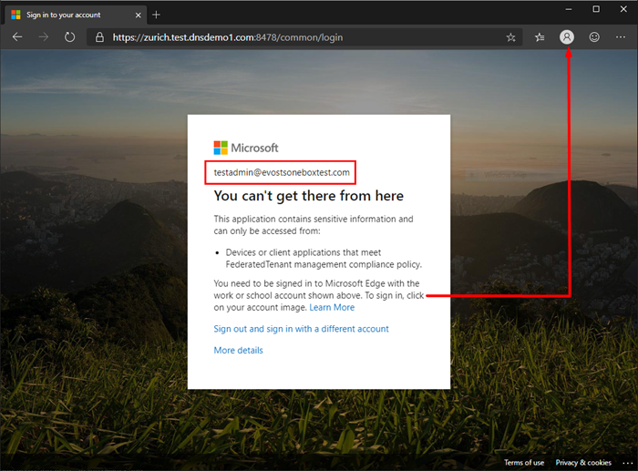

# Overview of Microsoft Edge security
  
IT admins in the enterprise are constantly facing a myriad of existing and emerging security challenges while protecting the corporate network and devices from malicious attacks and preventing unauthorized access and leaks of corporate data. Microsoft Edge provides several natively built, unique capabilities that help address these challenges.

> [!NOTE]
> This article applies to Microsoft Edge version 77 or later.

## Conditional Access

A key aspect of cloud security is identity and access when it comes to managing your cloud resources. In a mobile-first, cloud-first world, users can access your organization's resources using a variety of devices and apps from anywhere. As a result of this, just focusing on who can access a resource is not sufficient. You also need to factor in how a resource is accessed. Azure Active Directory (Azure AD) Conditional Access helps you master the balance between security and productivity.

### Accessing Conditional Access protected resources in Microsoft Edge

Microsoft Edge natively supports Azure AD Conditional Access. There's no need to install a separate extension. When you’re signed into a Microsoft Edge profile with enterprise Azure AD credentials, Microsoft Edge allows seamless access to enterprise cloud resources protected using Conditional Access.

On a compliant device, the identity accessing the resource should match the identity on the profile.  If it doesn't, you'll see a message like the one in the next screenshot. In the screenshot example, "testadmin@evostsoneboxtest.com" is the sign-in account needed to access the resource.

To continue, you have to switch to the required profile (if you have one) or create a profile with matching identity.

To sign in and work with your profile, click the account picture in the top right corner of the browser. You can use the dropdown menu to:

- Select another profile. Click the profile name.
- Create a profile. Click **Add a profile**.
- Manage your profiles. Click **Manage profile settings**.

This support is available across all platforms, including all supported versions of Windows and macOS.

### How to deploy Conditional Access in Azure Active Directory

[Deploy Conditional Access](https://docs.microsoft.com/azure/active-directory/conditional-access/plan-conditional-access) provides a detailed guide to help deploy Conditional Access in Azure Active Directory.

## Application Guard

Browsers remain the primary attack surface on client devices today because it’s their fundamental job to download and execute untrusted content from untrusted sources. Security incident prevention or detection/response strategies cannot guarantee 100% safety. Malicious actors are constantly at work to social engineer new forms of attacks against the browser. One of the security strategies to consider is the assume breach principle and ensure corporate network and other resources remain protected in such scenarios.

Designed for Windows 10 and Microsoft Edge, Application Guard uses a hardware isolation approach to isolate untrusted site navigations that launch inside a container. This helps enterprises safeguard their corporate network and data in assumed breach scenarios while the employees browse the Internet. The enterprise administrator defines what are trusted web sites, cloud resources, and internal networks; everything not on that list is considered untrusted and gets isolated from the corporate network and data on the device. Learn more about Application Guard [here](https://docs.microsoft.com/windows/security/threat-protection/windows-defender-application-guard/wd-app-guard-overview).

  > [!TIP]
  > Application Guard in Microsoft Edge is supported only on Windows 10 1809 (RS5) and above.

The following links provide additional information to get started using Application Guard with Microsoft Edge.

- [System requirements](https://docs.microsoft.com/windows/security/threat-protection/windows-defender-application-guard/reqs-wd-app-guard)
- [Installing Application Guard](https://docs.microsoft.com/windows/security/threat-protection/windows-defender-application-guard/install-wd-app-guard)
- [Configuring OS policies for Application Guard](https://docs.microsoft.com/windows/security/threat-protection/windows-defender-application-guard/configure-wd-app-guard)

## See also

- [Microsoft Edge Enterprise landing page](https://aka.ms/EdgeEnterprise)
